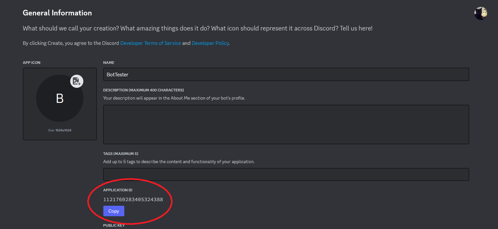
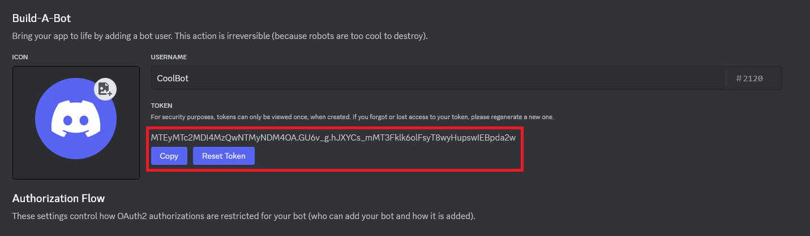

# Этот бот создан командой [StormShop](https://nitro-storm.ru)!

# Описание

1. Данный бот может отправлять сообщения всем участникам сервера, на котором он находится. Может использоваться для рассылок. Поддерживает закрепление файлов / картинок / гивок
2. Есть удобный API, который позволяет отправлять запросы на отправку сообщений. Может использоватся например для возможности отправить свои сообщения по форме на сайте, в телеграм боте и любых иных удобных для вас местах.

# Инструкция по пользованию

## Предустановка & Запуск

1. Если у вас не установлен [NodeJS](https://nodejs.org/ru) - установите его.
2. Для запуска бота зайдите в консоль и пройдите в папку с ботом.
    - Для того чтобы зайти в папку в консоли пропишите "cd <Полный путь до папки>"
3. В папке бота пропишите команду "npm install" для установки всех пакетов
4. В файле .env.production (или просто .env) заполните данные для вашего бота, а именно его токен и id клиента

## На скриншоте видно как его получить

 

5. Запустите бота "npm start"

## Примечание
Этот бот предоставляется исключительно в ознакомительных целях. Я не несу ответственности за способ его использования или действия, которые пользователи могут предпринять с его помощью. Пожалуйста, учитывайте, что бот сделан исключительно в ознакомительных целях! Вся ответственность за взаимодействие с этим ботом лежит на пользователе!